# ✈️ Travel Companion AI (Персональный планировщик путешествий)

## Что за задача, для кого и какая боль сейчас

**Задача:** Создать агентную систему — персонального ассистента для планирования путешествий, который учитывает предпочтения пользователя, бюджет, временные ограничения и внешние факторы (погода, сезонность, визовые требования, события), чтобы предложить оптимальный маршрут и варианты бронирования.

**Для кого:**
- Индивидуальные путешественники, тратящие часы на поиск и согласование отелей, билетов и экскурсий.
- Семьи с детьми, которым важны безопасность, детская инфраструктура и питание с учётом аллергий.
- Деловые путешественники, ценящие скорость и минимизацию простоев.
- Люди с ограниченными возможностями или особыми диетами, для которых стандартные поисковики часто бесполезны.

**Какая боль сейчас:**
- Планирование поездки требует переключения между 5–10 сервисами (поиск билетов, отелей, карты, отзывы, погода, визовые калькуляторы).
- Нет единого места, где хранятся предпочтения: пользователь каждый раз заново объясняет, что не летает лоукостерами или предпочитает отели с завтраком.
- При изменении планов (отмена рейса, болезнь) всё приходится перестраивать вручную.
- Легко пропустить важные ограничения: виза заканчивается до вылета, сезон дождей, религиозный праздник в стране назначения.
- Сложно оценить реальный бюджет — итоговая стоимость часто оказывается выше ожидаемой из-за скрытых сборов.

---

## Что именно сделает PoC на демо

PoC-версия Travel Companion AI будет реализована как чат-интерфейс с агентским ядром и эмулируемыми внешними сервисами. На демо система сможет:

1. **Принять запрос пользователя** в свободной форме: *«Хочу съездить куда-нибудь тёплое на 5–7 дней в июне, бюджет до 1000 евро на двоих, без визы, любим историю и вино»*.
2. **Проанализировать и уточнить вводные:**
   - Если бюджет мал для указанных пожеланий, агент предложит компромисс (например, Турцию вместо Италии).
   - Если даты не указаны, спросит примерный диапазон.
3. **Собрать данные из нескольких источников (эмуляция):**
   - **API погоды** — средняя температура, сезон дождей.
   - **Визовый API/база** — нужна ли виза, сроки оформления.
   - **API авиабилетов** — варианты перелётов с ценами (тестовые данные).
   - **API отелей** — варианты с фильтрацией (бассейн, завтрак, рядом с центром).
   - **База достопримечательностей** — список мест с типом (история, природа, развлечения).
   - **API событий** — фестивали, концерты, праздники в регионе.
4. **Сформировать персонализированные рекомендации:**
   - Предложить 2–3 направления, наиболее соответствующих критериям.
   - Для выбранного направления построить **план по дням** с учётом времени на перелёты и отдых.
   - Подсветить **«красные флаги»**: нужна виза, неблагоприятный сезон, высокий турсбор.
5. **Учесть сквозную память:**
   - Пользователь ранее указал, что не ест свинину. Агент будет фильтровать рестораны и экскурсии с обедами.
   - Пользователь предпочитает прямые рейсы даже дороже — агент запомнит и будет применять этот фильтр по умолчанию.
6. **Обработать изменение планов:**
   - Пользователь: *«Давай удешевим»*. Агент предложит альтернативные даты, отели классом ниже или бюджетный перелёт с пересадкой.
7. **Сгенерировать итоговый отчёт:**
   - Сводка по поездке: перелёты, отель, маршрут по дням, бюджет с разбивкой, чек-лист подготовки (виза, страховка, прививки).

---

## Что НЕ делает PoC (явные out-of-scope)

- **Реальное бронирование и оплата** — все запросы на бронь эмулируются, деньги не списываются, подтверждения не высылаются.
- **Интеграция с реальными календарями и почтой** — нет синхронизации с Google Calendar или Outlook.
- **Поиск попутчиков и групповые туры** — только индивидуальное планирование.
- **Актуальные данные в реальном времени** — используются заранее подготовленные тестовые датасеты.
- **Поддержка множества языков** — только русский язык интерфейса (для демо).
- **Мобильное приложение** — только веб-интерфейс (чат).
- **Полное покрытие всех стран** — ограниченный набор направлений (5–10 популярных стран) для демонстрации логики.

## Архитектура и документация

Полный системный дизайн, диаграммы и спецификации находятся в папке [`docs/`](docs/):

- [`system-design.md`](docs/system-design.md) – ключевые архитектурные решения, модули, workflow, state/memory/context, retrieval‑контур, tool‑интеграции, failure modes и guardrails.
- [`diagrams/`](docs/diagrams/) – диаграммы на языке PlantUML + сгенерированные PNG:
  - [c4_context.svg](docs/diagrams/c4_context.svg) — контекстная диаграмма (C4 Context)
  - [c4_container.svg](docs/diagrams/c4_container.svg) — контейнеры системы
  - [c4_component.svg](docs/diagrams/c4_component.svg) — компоненты ядра
  - [workflow.svg](docs/diagrams/Workflow.svg) — основной workflow выполнения запроса с ветками ошибок
  - [dataflow.svg](docs/diagrams/data_flow.svg) — поток данных через систему
- [`specs/`](docs/specs/) – спецификации модулей:
   - [retriever.md](docs/specs/retriever.md) – поисковый инструмент (DuckDuckGo), ограничения, fallback.
   - [tools.md](docs/specs/tools.md) – контракты, таймауты, обработка ошибок.
   - [memory.md](docs/specs/memory.md) – сессионное состояние, бюджет контекста, политика памяти.
   - [agent.md](docs/specs/agent.md) – оркестрация, правила переходов, stop conditions, retry/fallback.
   - [serving.md](docs/specs/serving.md) – конфигурация, секреты, версии моделей.
   - [observability.md](docs/specs/observability.md) – метрики, логи, трейсы, проверки качества.

## Ключевые архитектурные решения

- **LLM‑агент** (Mistral Large) с function calling – сам принимает решение о вызове инструментов.
- **Инструмент поиска** – `search_internet` через DuckDuckGo (бесплатный, без API‑ключа).
- **Память** – в памяти процесса (сессия) + SQLite для долгосрочного хранения планов.
- **State machine** – aiogram FSM для управления диалогом.
- **Оркестрация** – опционально LangGraph для сложных сценариев; в текущей версии – легковесный диспетчер вызовов.
- **Отказоустойчивость**: при недоступности LLM или таймауте (p99 < 240 с) пользователь получает понятное сообщение, бот сохраняет состояние.
- **Безопасность**: секреты в `.env`, `.gitignore` исключает их из репозитория. Контентная модерация на уровне системного промпта.
- **GDPR**: в демо‑режиме данные не покидают среду, регистрация отсутствует → GDPR не применяется.
- **Verifier**: функция проверки релевантности ссылок встроена в промпт – модель сама отбрасывает нерелевантные результаты.

## Стек

- **Язык:** Python 3.12
- **Фреймворк бота:** aiogram 3.x
- **LLM:** Mistral API (OpenAI‑совместимый SDK) с возможностью переключения на OpenRouter
- **Оркестрация:** опционально LangGraph (для сложных цепочек)
- **Поиск:** DuckDuckGo (пакет `ddgs`)
- **Хранение:** SQLite (aiosqlite), in‑memory кэш диалогов
- **Конфигурация:** python‑dotenv

## Запуск

1. Клонируйте репозиторий и перейдите в папку проекта.
2. Создайте и активируйте виртуальное окружение:
   ```bash
   python -m venv venv
   source venv/bin/activate      # Linux/macOS
   venv\Scripts\activate         # Windows

## Ограничения и риски

- **Latency**: среднее время ответа 5–15 сек (зависит от числа поисковых запросов). Возможен стриминг ответов для улучшения UX.
- **Cost**: Mistral API – платный, необходимо контролировать расход токенов.
- **Таймаут** LLM: при превышении 240 сек возвращается fallback‑сообщение.
- **Сбои поиска**: DuckDuckGo может вернуть пустой результат – в этом случае модель использует свои знания.

## Observability
- Логирование всех вызовов LLM и инструментов.
- Трассировка диалогов (в планах – интеграция с LangSmith).
- Мониторинг времени ответа и ошибок.

## Диаграммы
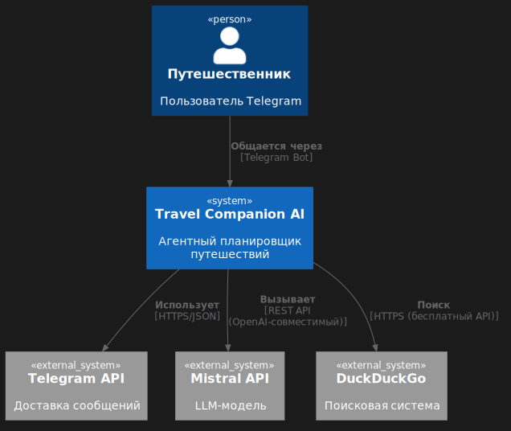
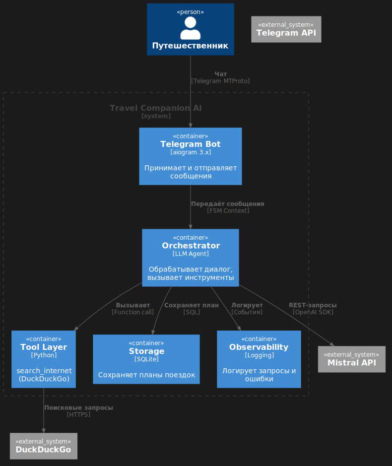
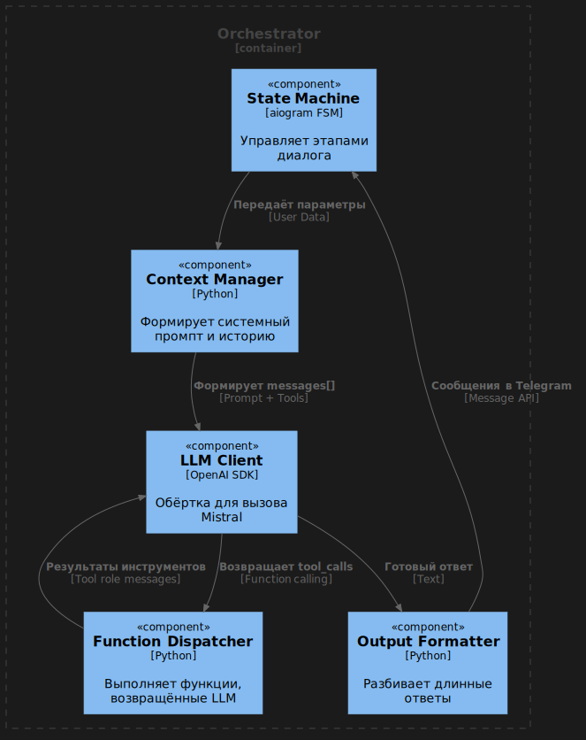
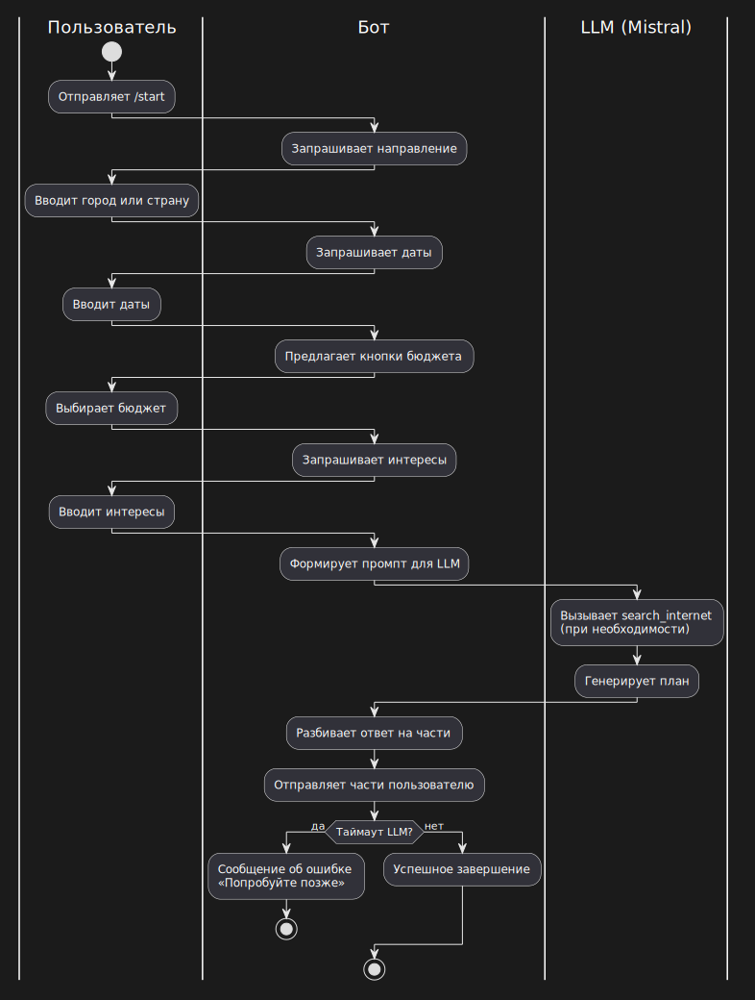


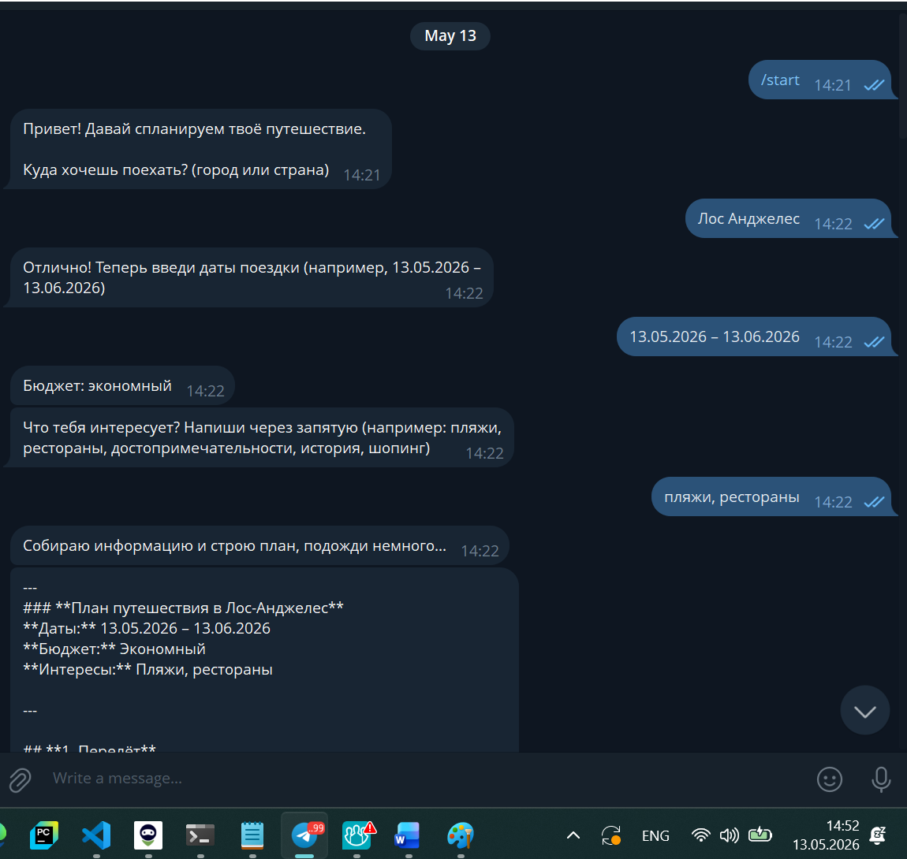
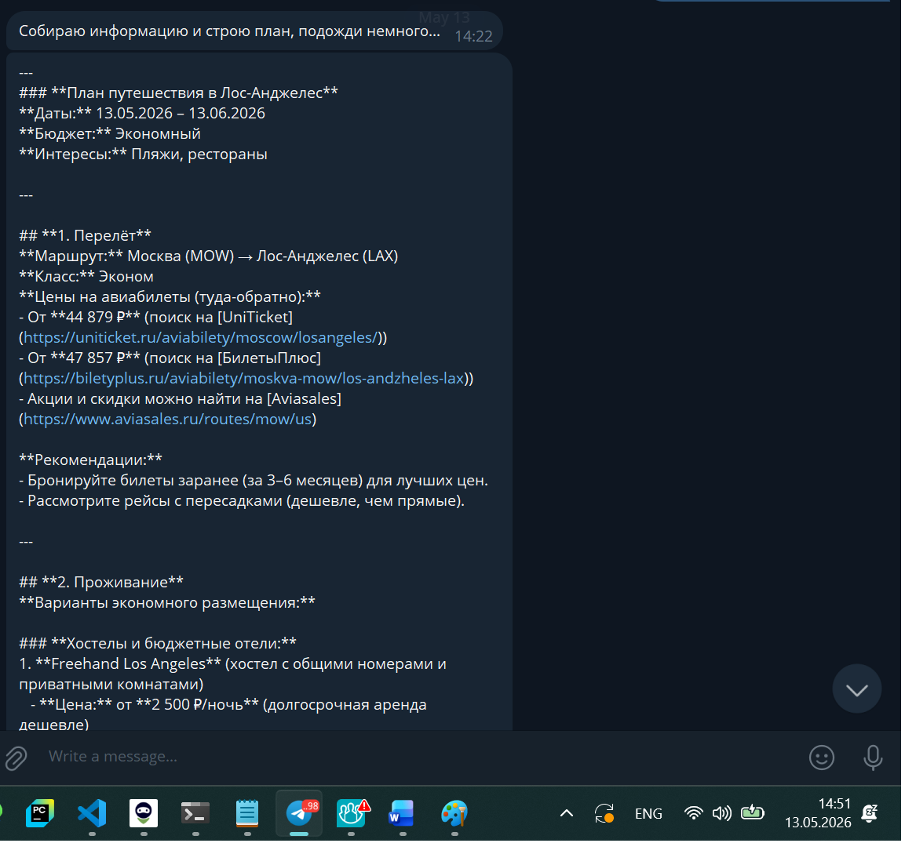
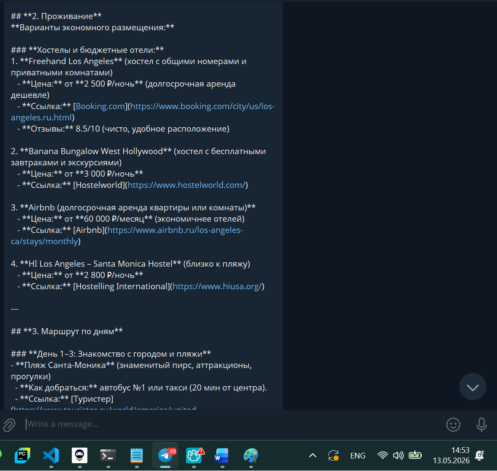
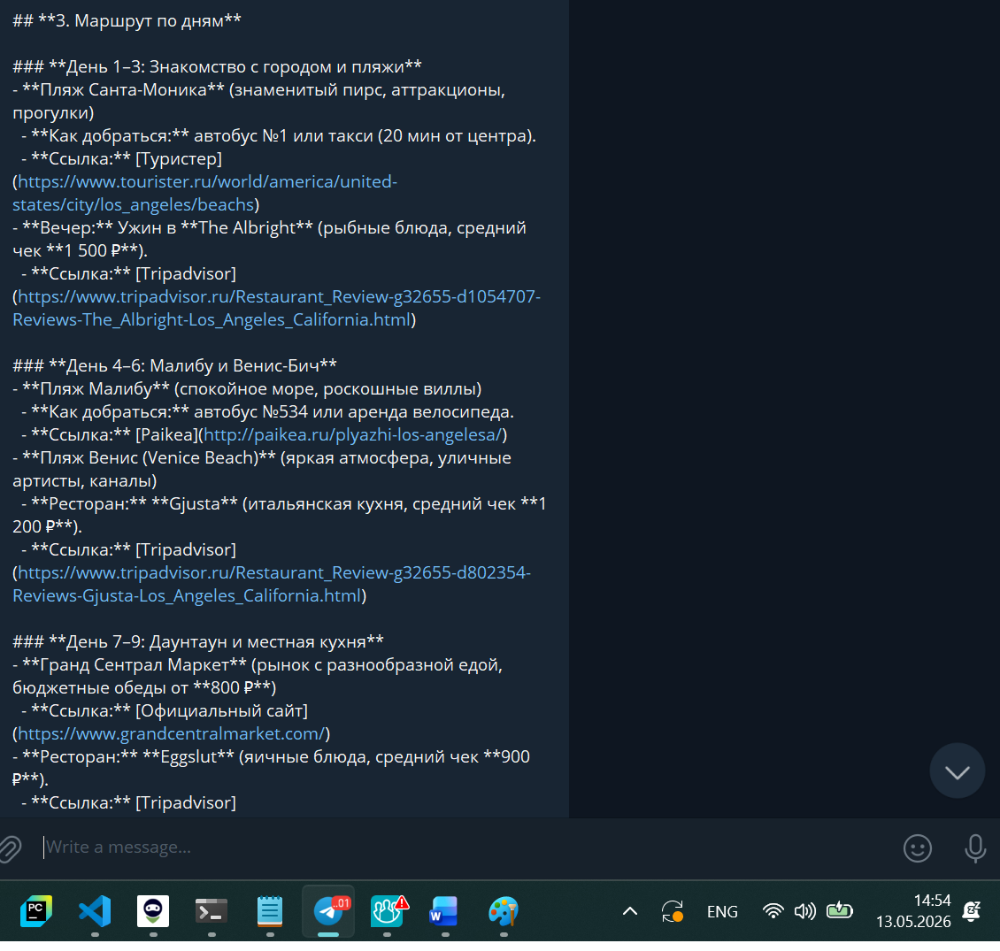
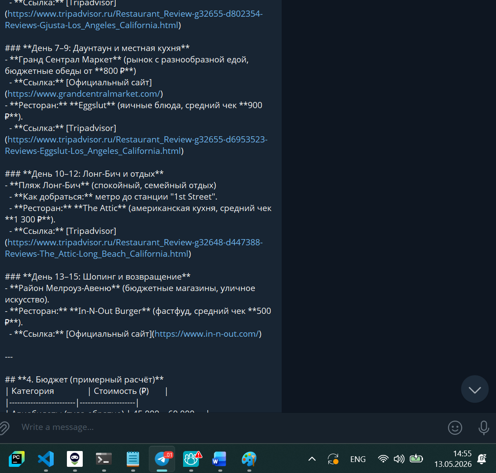
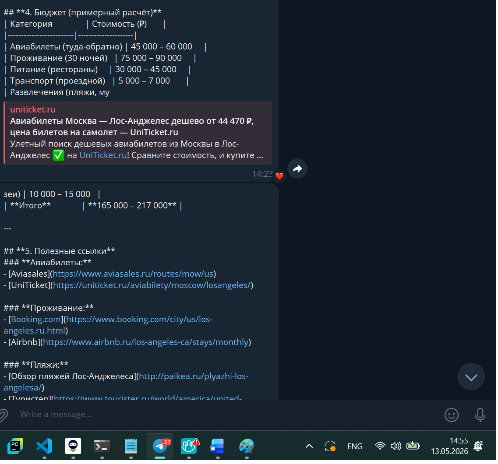
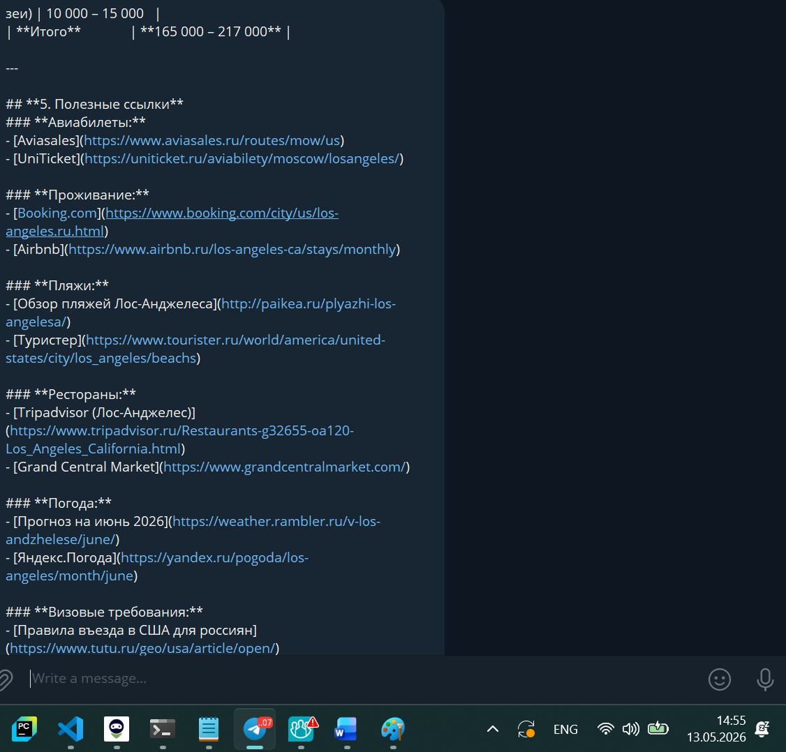
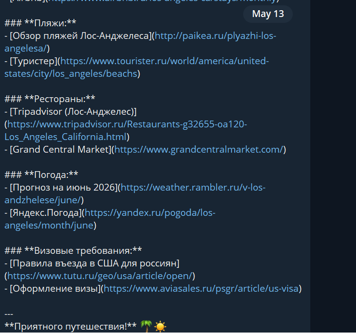
